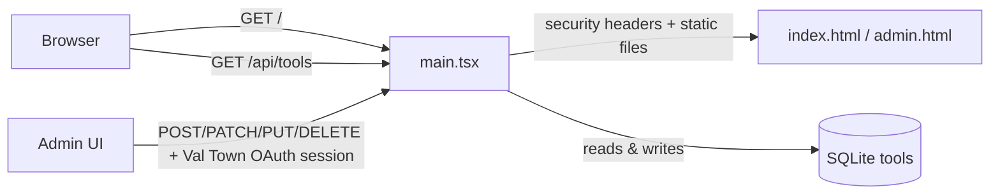

# DevFreeStack

A curated directory of **100% free** developer tools, infrastructure, and services — hosting, databases, DNS, email APIs, and AI coding assistants.

**No trials that expire in 14 days. No credit card required.**

[Open the live site →](url:index.html) · [Admin →](url:admin.html)

---

## Architecture

Tools live in SQLite, not in the HTML. The page fetches them at runtime, so adding an entry is a form submission rather than a code change.



| File | Role |
| --- | --- |
| [`main.tsx`](url:main.tsx) | Router — `/api/*` handled here, everything else served statically |
| [`db.ts`](url:db.ts) | Schema, validation, CRUD |
| [`seed-data.ts`](url:seed-data.ts) | Initial 26 tools (used only to seed an empty table) |
| [`index.html`](url:index.html) | Public directory — fetches `/api/tools` |
| [`admin.html`](url:admin.html) | Add / edit / delete tools |
| `favicon.svg` | Site icon |

## Editing tools

The admin UI is at **[`/admin.html`](url:admin.html)** (not linked from the public site, and marked `noindex`).

Writes require an authenticated Val Town session and are restricted server-side to the username configured in the encrypted `ADMIN_VAL_USERNAME` environment variable. The browser does not store or send a reusable admin credential. Reads remain public.

The authorized account is configured with `ADMIN_VAL_USERNAME`; do not expose this value in client-side code.

### API

| Method | Path | Auth | Purpose |
| --- | --- | --- | --- |
| `GET` | `/api/tools` | public | List all tools |
| `GET` | `/api/tools/:id` | public | Get one tool |
| `GET` | `/api/status` | public | Auth/write availability, count, category & tier vocabulary |
| `POST` | `/api/tools` | Val Town OAuth | Create |
| `PATCH` | `/api/tools/:id` | Val Town OAuth | Partial update |
| `PUT` | `/api/tools/:id` | Val Town OAuth | Full update |
| `DELETE` | `/api/tools/:id` | Val Town OAuth | Delete |

Validation happens server-side (`validate()` in `db.ts`): name and description required, URL must be a valid absolute `http(s)` URL, tier must be one of the three known values, at least one category required. Names are unique case-insensitively. Failures return `400` with a human-readable message, `409` on a duplicate name.

## Data model

```sql
CREATE TABLE tools (
  id          INTEGER PRIMARY KEY AUTOINCREMENT,
  name        TEXT NOT NULL,
  cats        TEXT NOT NULL,        -- comma-separated category ids
  tier        TEXT NOT NULL,
  icon        TEXT NOT NULL,        -- Lucide icon name
  url         TEXT NOT NULL,
  description TEXT NOT NULL,
  code_label  TEXT,                 -- optional invite/referral code
  code_value  TEXT,
  sort_order  INTEGER NOT NULL,
  created_at  TEXT NOT NULL,
  updated_at  TEXT NOT NULL
);
```

`cats` is a comma-separated string rather than a join table — at directory scale it saves ceremony, and filtering happens client-side anyway.

**Categories:** `dns`, `comms`, `ai`, `edge`, `paas`, `db`. A tool may belong to several (Wasmer.io is both `edge` and `paas`), and it then appears under each of those pills.

**Tiers:** `Forever Free` (green), `Free Tier` (blue), `Open Source` (violet).

### Invite & referral codes

The optional `code` field renders a click-to-copy chip on the card, and its value is included in the search index — so pasting `ESB9EDBVDE` into the search bar finds DNSHE.

## Public site features

- **Live search** across name, description, tier, category labels, and code values
- **Category pills** with live counts, plus a **Saved** filter backed by `localStorage`
- **Bookmarks** — star any card; persists across reloads
- **Click-to-copy** for both the tool URL and any invite code
- Keyboard: `/` focuses search, `Esc` clears it
- Loading, error-with-retry, and empty states

## Seeding

`db.ts` seeds from `seed-data.ts` on first run, only when the `tools` table is empty. Editing `seed-data.ts` afterwards has no effect on a populated database — use the admin UI, or call `resetSeed()` (destructive: wipes the table and re-inserts the original 26).

## Publishing to GitHub

The repo at [github.com/vijevira/devfreestack](https://github.com/vijevira/devfreestack) is a
**mirror, not the source of truth** — the val is.

[`publish-to-github.ts`](url:publish-to-github.ts) syncs this val's files to the repo. Click Run: it
walks every file, compares each against what's on GitHub, and creates **one atomic commit** containing
all changes. It also removes remote files that no longer exist in the val. Safe to re-run whenever you
edit the directory here; if nothing changed, no commit is created.

Requires a `GITHUB_TOKEN` environment variable with write access to the repo — classic token with
`repo` scope, or a fine-grained token with **Contents: Read and write**.

👉 Add `GITHUB_TOKEN` here: https://www.val.town/x/vijevira/devfreestack/environment-variables?key=GITHUB_TOKEN

Optional overrides: `GITHUB_REPO` (defaults to `vijevira/devfreestack`) and `GITHUB_BRANCH`
(defaults to the repo's default branch).

One thing it deliberately does not do:

- **It never publishes itself.** `publish-to-github.ts` is in the sync's skip list, so the repo
  contains only the project.

## Contributing

Suggestions arrive as GitHub issues filed through
[`.github/ISSUE_TEMPLATE/suggest-a-tool.yml`](.github/ISSUE_TEMPLATE/suggest-a-tool.yml).
The form's fields mirror the database schema (`name`, `url`, `cats[]`, `tier`, `description`, `code`),
so accepting one is a copy-paste into the admin UI rather than a transcription job. Issues land
labelled `suggestion`.

Three entry points on the site link to it:

| Placement | Why |
| --- | --- |
| Header button | Always visible, one click from anywhere |
| Empty state | Highest intent — they searched for something we don't have |
| Footer | Conventional place to look |

There is no in-app form and no suggestion database. Moderation, spam handling, notifications and
threaded discussion are all GitHub's job, which is the whole reason for going this route.

## Disclosure

Some outbound links carry referral or invite parameters (`?r=`, `?referralCode=`, invite codes). They cost the visitor nothing and never change what a tool's free tier includes — the directory only ever lists tools that are genuinely free to use.

## Notes

Free tiers change constantly. Every vendor's current terms are the source of truth — this directory links out rather than mirroring pricing pages.

---

Built for developers who love free infrastructure.